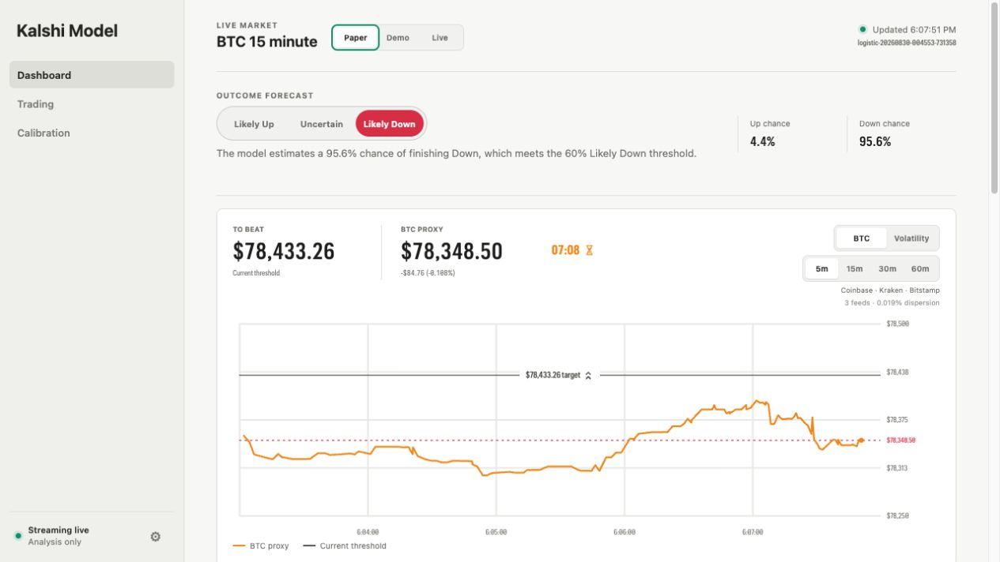
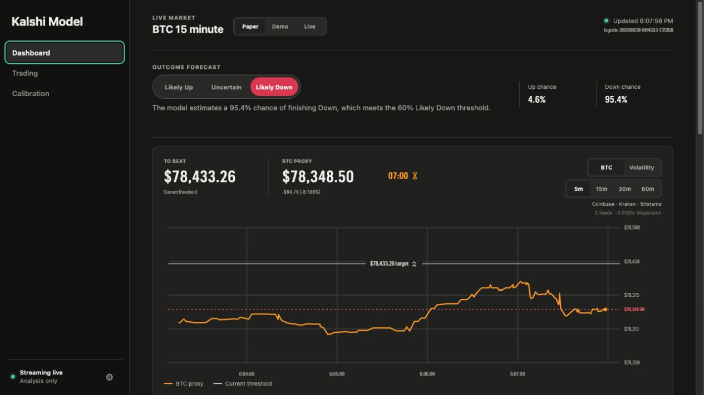
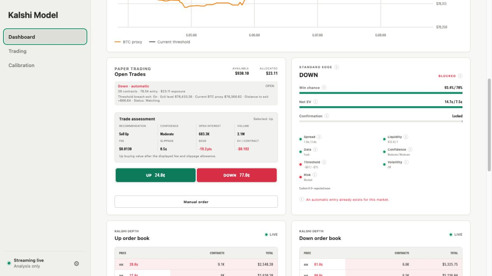
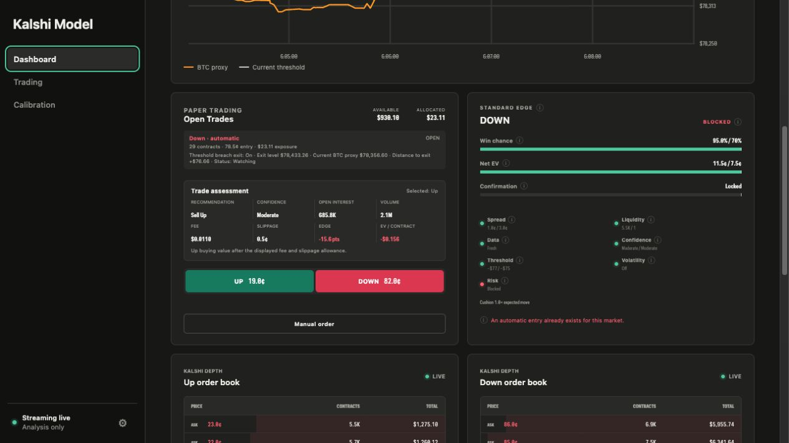
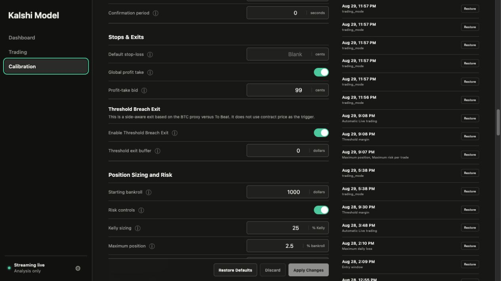
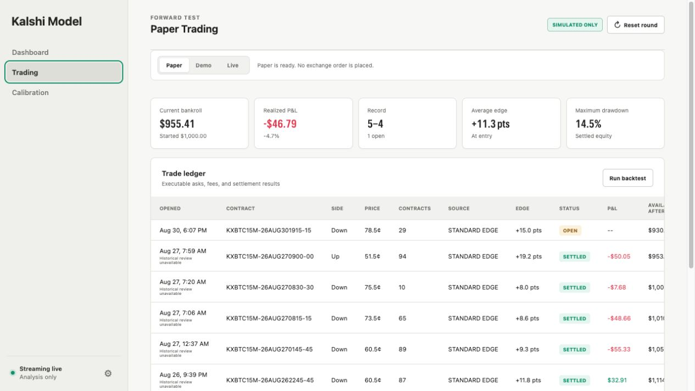
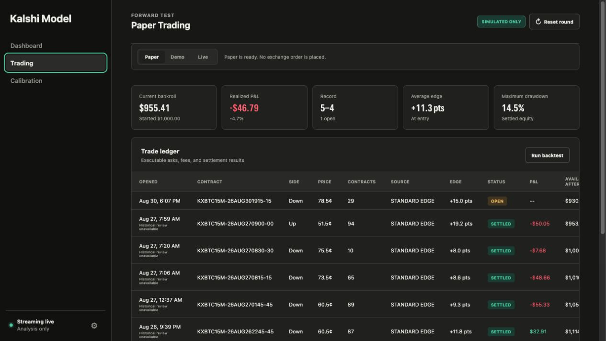
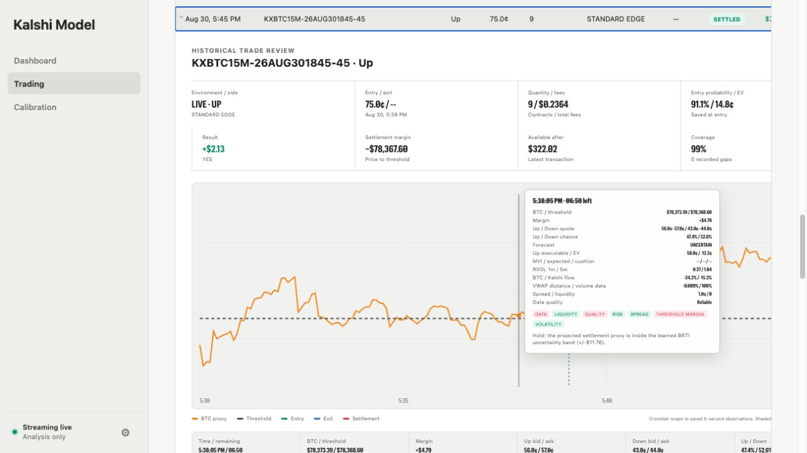
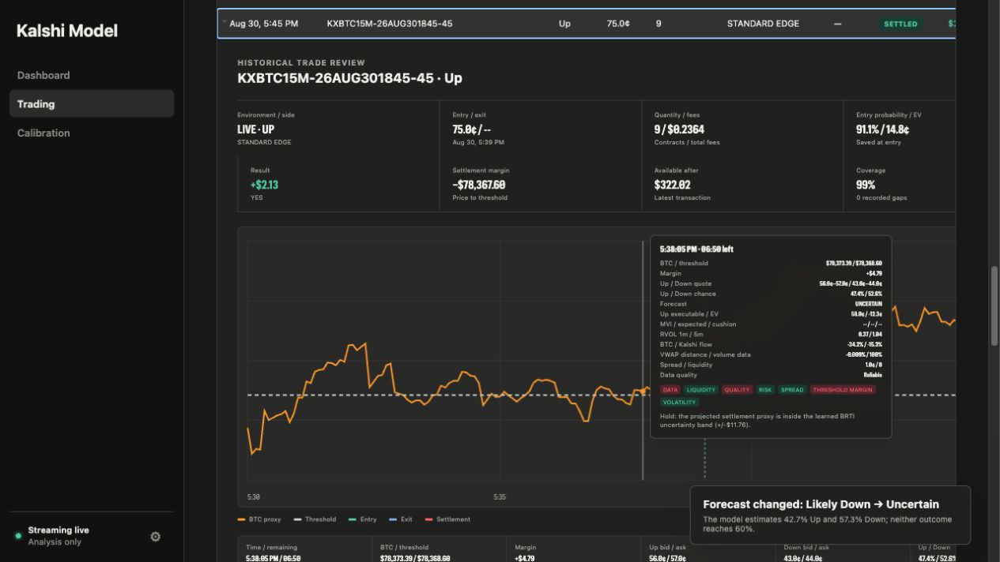

# Kalshi Model

A local macOS research and trading app for Kalshi's 15-minute Bitcoin Up or Down markets. Think of each market as a fast hand of intelligent poker: read the board, estimate the odds, make only the small bets the edge earns, and fold when the table turns. The model prices probability first, sizes risk conservatively, and uses a Threshold Breach Exit to fold and close positions when the BTC proxy crosses the threshold.

> Research only, not financial advice. Live trading can lose real money.

<table>
  <tr>
    <td width="50%"></td>
    <td width="50%"></td>
  </tr>
  <tr>
    <td align="center"><strong>Light</strong></td>
    <td align="center"><strong>Dark</strong></td>
  </tr>
</table>

## Features

- **Dashboard:** Live BTC proxy, outcome forecast, Open Trades, Standard Edge HUD, dual order books, and recent trades.
- **BTC proxy:** Median Coinbase, Kraken, and Bitstamp price with learned BRTI uncertainty.
- **Three modes:** Paper, isolated Kalshi Demo, and deliberately armed Kalshi Live.
- **Mobile Monitor:** Read-only HUD, market metrics, and recent trades on iPhone through Tailscale.
- **Strategies:** Standard Edge probability-and-value entries, plus an optional Texas Hold’em opening play with Flop, Turn, and River exits.
- **Protective exits:** Configurable profit take, stop-loss, and Threshold Breach Exit rules.
- **Calibration:** Tune Standard Edge, exits, risk controls, and review probability, volatility, and volume evidence.
- **Trade review:** Expand a settled trade to replay its BTC, probability, MVI, readiness, and execution history.
- **Local data:** Settings, evidence, trades, review snapshots, reports, and backups stay in SQLite on your Mac.

## Outcome forecast

- **Likely Up:** Up probability is 60% or higher.
- **Uncertain:** Up probability is above 40% and below 60%.
- **Likely Down:** Up probability is 40% or lower.
- The forecast always describes the expected outcome; price, edge, and trade action stay in **Trade assessment**.

## Standard Edge HUD

<table>
  <tr>
    <td width="50%"></td>
    <td width="50%"></td>
  </tr>
  <tr>
    <td align="center"><strong>Light</strong></td>
    <td align="center"><strong>Dark</strong></td>
  </tr>
</table>

- Win chance and net EV fill toward their configured targets; confirmation starts only after every entry requirement passes.
- Spread, liquidity, data, quality, threshold, volatility, and risk show what is blocking an automatic entry.
- **MVI** scores 30-minute threshold-margin volatility from 0–10; cushion compares today’s margin with the expected remaining move.
- Hover over an info icon for a plain-language explanation of any metric.

When Texas Hold’em is enabled, this card becomes a three-street strategy HUD. Its Flop, Turn, and River bars fill smoothly through each five-minute phase, show the active exit target and River stop, and allow quick target edits on the Mac. The iPhone monitor mirrors the state without exposing controls.

## Calibration



- Apply saves one auditable configuration snapshot; Discard and Restore are reversible.
- Results show settled samples, Brier score, and calibration in 10-point probability ranges.
- Margin Volatility has one maximum setting; `0` leaves the gate off while evidence accumulates.
- Automatic entries still require a valid price, positive Buy EV, confirmation, liquidity, and risk approval.
- The Texas Hold’em section controls its 50¢ opening cap, 20-second attempt window, two fresh-market-state retries, phase targets, and River stop. It is off by default.

## Kalshi credentials

- Public REST works without credentials; a read key enables faster market-data streaming.
- Demo and Live trading use separate write-enabled keys and separate account histories.
- Add keys in **Settings**; private copies stay under `~/Library/Application Support/Kalshi Model/`.
- Never commit `.env`, your Key ID, or your private key.

<details>
<summary>Developer <code>.env</code> setup</summary>

```bash
cp .env.example .env
```

```bash
KALSHI_API_KEY_ID=your-key-id
KALSHI_PRIVATE_KEY_PATH=/absolute/path/to/your-private-key.pem
KALSHI_DEMO_API_KEY_ID=your-demo-key-id
KALSHI_DEMO_PRIVATE_KEY_PATH=/absolute/path/to/demo-key.pem
KALSHI_LIVE_API_KEY_ID=your-live-key-id
KALSHI_LIVE_PRIVATE_KEY_PATH=/absolute/path/to/live-key.pem
```

</details>

## How the model works

The model has one simple loop: estimate the odds, compare them with the price, then protect the hand.

| Step | What it does |
| --- | --- |
| **1. Read the market** | Builds a clean BTC proxy from Coinbase, Kraken, and Bitstamp; then measures its distance from To Beat, time left, volatility, and data reliability. |
| **2. Price the outcome** | Turns that context and settled-market history into an Up/Down probability. A forecast is a probability estimate—not a trade instruction. |
| **3. Test the bet** | Compares probability with the executable contract price after fees and slippage. A likely outcome can still be a bad price. |
| **4. Manage the hand** | Requires confirmation and gates before entry, limits size, and manages exits once a position exists. |

### What can open a trade

Standard Edge looks for a sustained pricing advantage and confirms it against the configured probability, value, data, market-quality, and risk requirements before entering.

Every entry must clear probability, EV, spread, liquidity, data, confidence, threshold distance, BTC directional momentum, volatility, confirmation, allocation, and risk checks. By default, a 15-second BTC-proxy regression must move at least $1 upward for Up or downward for Down. The HUD shows these checks live so it is clear what the model is waiting on.

Texas Hold’em is an alternative automatic strategy. Once the official market opens and To Beat is known, it buys the contract opposite BTC’s opening position versus the threshold—Down when BTC is above it, Up when BTC is below it—only when the all-in executable price is 50¢ or less. It sends one IOC attempt and up to two remaining-quantity retries on genuinely new market state during the first 20 seconds; otherwise it folds until the next market. Standard Edge entries are disabled while this strategy is on.

### How it protects a trade

Margin Volatility measures how choppily BTC is moving around To Beat. It can block automatic entries when the configured maximum is exceeded; its cushion is recorded for review, not used as an entry gate.

Profit take exits at a configured executable bid—99¢ by default—and stop-losses remain optional. Threshold Breach Exit is the model's fold: its signed buffer can trigger before To Beat or tolerate a configured adverse move beyond it before closing. These are safeguards, not guarantees of an exit price or fill.

Texas Hold’em positions use their own market-state exits: 60¢ during the Flop, 50¢ during the Turn, and 95¢ during the River by default. A 60¢ River stop becomes active only in the final five minutes. Texas positions deliberately ignore Threshold Breach Exit and the ordinary stop because the opening play begins contrarian; phase exits use aggressive reduce-only IOC sells and never reverse the position.

### How it improves

Calibration compares forecasts with settled outcomes by strategy and mode. Judge it over many markets, not a short streak.

<details>
<summary><strong>Volume signals — currently shadow-only</strong></summary>

The app records relative volume, signed BTC flow/CVD, volume-confirmed momentum, VWAP position, Kalshi flow/turnover, and cross-venue agreement. They are evaluated alongside time remaining, threshold distance, volatility, and data quality, but do not change live probability yet. They must first demonstrate better out-of-sample Brier score and calibration on enough settled markets.

</details>

## Paper, Demo, and Live

<table>
  <tr>
    <td width="50%"></td>
    <td width="50%"></td>
  </tr>
  <tr>
    <td align="center"><strong>Trading · Light</strong></td>
    <td align="center"><strong>Trading · Dark</strong></td>
  </tr>
</table>

- **Paper:** Local simulated fills and bankroll; no Kalshi order is sent.
- **Demo:** Kalshi's test exchange is the source of truth for balance, orders, partial fills, fees, positions, and settlement.
- **Live:** Real funds. Demo verification, reviewed limits, two-click session arming, and a separate Automatic switch are required.

Demo and Live default to a 100% eligible-funds cap, but strategy sizing and hard limits still keep individual orders smaller. Positions, resting buys, pending intents, fees, and reserved exposure all count against the cap.

All exchange orders are price-limited and may fill partially. A kill switch blocks new submissions and attempts to cancel resting orders. After a restart or disconnect, the app reconciles with Kalshi and requires rearming.

Stop-losses and the global profit take are app-managed in Demo and Live. They work only while the app is running, connected, authenticated, reconciled, and armed; execution is not guaranteed.

## Historical trade review

<table>
  <tr>
    <td width="50%"></td>
    <td width="50%"></td>
  </tr>
  <tr>
    <td align="center"><strong>Light</strong></td>
    <td align="center"><strong>Dark</strong></td>
  </tr>
</table>

- Click a settled trade to open its full 15-minute review directly in the ledger.
- Move across the chart for saved price, probability, MVI, volume flow, EV, readiness, and data-quality readings.
- Entry, exit, and settlement markers explain when the position changed; recording gaps stay visible.
- Reviews are recorded only for traded markets; open and legacy trades do not invent history.

## Mobile Monitor

The read-only iPhone view shows To Beat, BTC Proxy, the Kalshi timer, Standard Edge or Texas Hold’em readiness, and the latest 10 trades for the environment selected on the Mac.

1. Install Tailscale on the Mac and iPhone, then enable **Settings → Mobile Monitor**.
2. Click **Copy command**, paste it into Terminal, and press Return. The app uses the full CLI command required by Mac App Store installations.
3. Terminal prints the private `https://…ts.net` address. Click **Refresh private URL**, open it in iPhone Safari, then choose **Share → Add to Home Screen → Open as Web App**.

The monitor has no trading controls and exposes only a dedicated read-only port. The Mac must remain awake, running, and connected. See [Tailscale Serve setup](https://tailscale.com/docs/features/tailscale-serve).

## Download

[**Download the latest Apple Silicon Mac app**](https://github.com/jganiyu/kalshi-model/releases/latest/download/Kalshi-Model-macOS-arm64.zip), move it to Applications, then right-click **Open** on first launch.

## Run from source

```bash
git clone https://github.com/jganiyu/kalshi-model.git
cd kalshi-model
./start.sh
```

Requires macOS and Python 3.11 or newer; the app opens at [http://127.0.0.1:8765](http://127.0.0.1:8765).

## Test

```bash
.venv/bin/python -m pytest
```

The suite never sends Live orders. Demo order creation and cancellation are opt-in:

```bash
KALSHI_DEMO_E2E=1 KALSHI_DEMO_TEST_TICKER=your-demo-market .venv/bin/python -m pytest tests/test_kalshi_demo_e2e.py
```

## Build the Mac app

```bash
./scripts/build_macos_app.sh
```

The signed ZIP is written to `dist/`.
