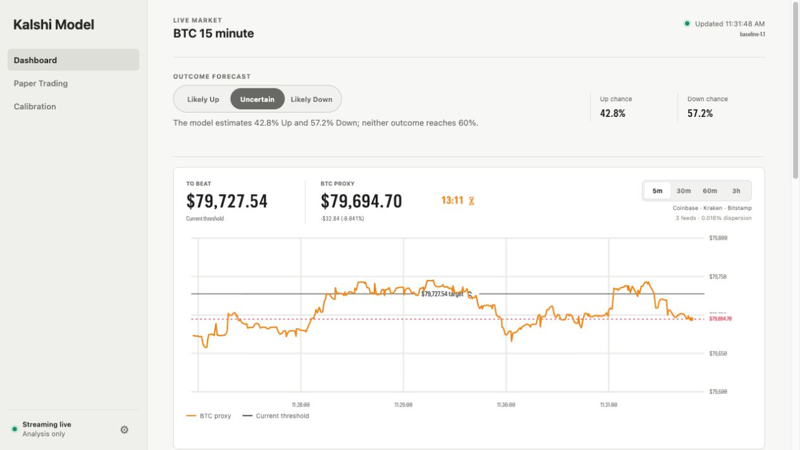
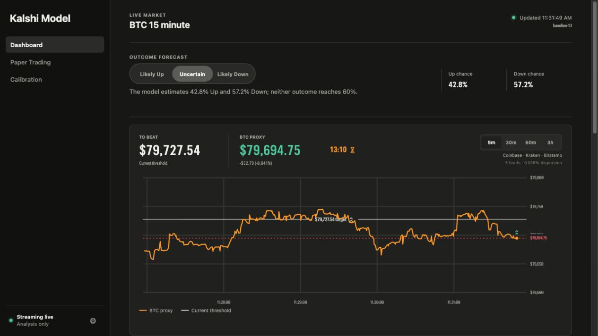
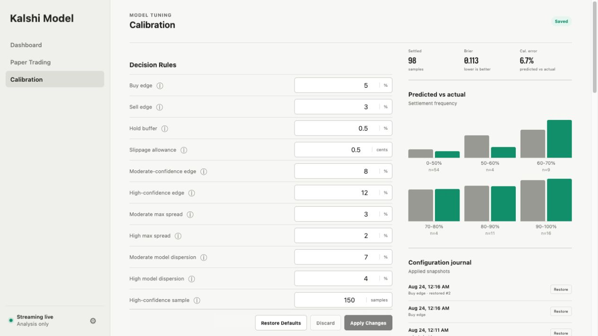

# Kalshi Model

A local macOS research and paper-trading app for Kalshi's 15-minute Bitcoin Up or Down markets; it never places real-money orders.

> Research only, not financial advice.

<table>
  <tr>
    <td width="50%"></td>
    <td width="50%"></td>
  </tr>
  <tr>
    <td align="center"><strong>Light</strong></td>
    <td align="center"><strong>Dark</strong></td>
  </tr>
</table>

## Features

- **Dashboard:** Live BTC proxy, outcome forecast, Kalshi contract, chart, order books, and paper controls.
- **BTC proxy:** Median Coinbase, Kraken, and Bitstamp price with learned BRTI uncertainty.
- **Paper trading:** Manual, limit, and confirmed automatic entries with per-entry stop-losses.
- **Calibration:** Tune decision, automation, risk, data-quality, and promotion rules in one place.
- **Local data:** Settings, evidence, trades, snapshots, reports, and backups stay in SQLite on your Mac.

## Outcome forecast


- **Likely Up:** Up probability is 60% or higher.
- **Uncertain:** Up probability is above 40% and below 60%.
- **Likely Down:** Up probability is 40% or lower.
- The forecast always describes the expected outcome; price, edge, and trade action stay in **Trade assessment**.

## Calibration



- Apply saves one auditable configuration snapshot; Discard and Restore are reversible.
- Results show settled samples, Brier score, and calibration in 10-point probability ranges.
- Automatic entries require a valid sustained trade decision; the outcome forecast never opens a position by itself.

## Kalshi credentials


- Public REST data works without credentials; a Key ID and RSA private key enable live WebSocket prices.
- Add them in **Settings**; the private copy stays under `~/Library/Application Support/Kalshi Model/`.
- Never commit `.env`, your Key ID, or your private key.

<details>
<summary>Developer <code>.env</code> setup</summary>

```bash
cp .env.example .env
```

```bash
KALSHI_API_KEY_ID=your-key-id
KALSHI_PRIVATE_KEY_PATH=/absolute/path/to/your-private-key.pem
```

</details>

## How the model works

Each market asks whether Bitcoin's official settlement value will finish above a fixed threshold; a correct Up or Down contract pays $1.

### 1. Estimate the settlement value

The app starts with the median BTC price from Coinbase, Kraken, and Bitstamp, which reduces the effect of a bad quote from one exchange.

It then measures the historical difference between its exchange proxy and Kalshi's BRTI settlement values, using that record to correct known bias and add a conservative uncertainty band.

During the final 60 seconds, the model blends the observed proxy average with the current price for the remaining seconds because Kalshi settles against an average, not a single last price.

### 2. Convert price distance into probability

The baseline model compares the projected settlement value with the threshold and scales that distance by expected volatility and benchmark uncertainty.

A small, time-decaying momentum adjustment is added before the resulting standardized distance is converted into an Up probability with a normal distribution; estimates are capped between 1% and 99%.

The model also records volatility, momentum, recent range, volume acceleration, exchange dispersion, order-book imbalance, market price, time remaining, closing-window progress, and benchmark uncertainty.

The forecast is Likely Up at 60% or more, Likely Down at 40% or less, and Uncertain between those levels.

### 3. Let a trained model earn promotion

The baseline remains active until enough settled markets exist to train a regularized logistic model on those recorded features.

Every candidate is tested one market at a time with expanding-window forward validation, so a future result cannot influence an earlier prediction.

A candidate replaces the active model only after meeting the sample and time requirements, improving Brier score by the required margin, and avoiding a material loss of calibration.

### 4. Price the trade separately

For Up, the model uses its Up probability; for Down, it uses `1 − Up probability`.

- `Buy edge = selected probability − (ask + slippage) − estimated fee`
- `Sell edge = (bid − slippage) − estimated fee − selected probability`

Trade assessment compares the selected contract with its executable bid or ask; changing that selection never changes the Up forecast.

Buy appears only when executable edge clears the configured threshold and estimated win chance is at least 55%; lower-probability positive-edge contracts remain Speculative trades even when the forecast is Likely Down.

For example, a 65% Up estimate against a 55¢ ask becomes about 55.5¢ after default slippage and roughly 1.7¢ in fees, leaving about 7.8 percentage points of Buy edge before the remaining safety checks.

### 5. Apply trade safeguards

The model holds when feeds are stale, exchanges disagree, executable quotes are missing, the market is closing, final-minute coverage is sparse, or the projected value sits inside the learned BRTI uncertainty band.

Edge strength rises only when edge is larger, spreads are tighter, probability estimates agree across volatility assumptions, and the calibration record is deep and accurate enough; it is not model confidence.

Automatic entries also require minimum win probability, positive edge after fees and slippage, confirmation time, minimum edge strength, liquidity, and risk approval.

Calibration measures the underlying Up probability in 10-point ranges, not the trade action.

### 6. Size the position

Suggested size uses fractional Kelly sizing, then applies stricter caps for bankroll share, trade risk, available liquidity, open positions, and session drawdown.

### Using it well

- Separate forecast from price: a likely outcome can be a bad trade, while an unlikely outcome can be underpriced.
- Treat probability as uncertainty, not certainty; even a well-calibrated 70% forecast should lose about 3 times in 10.
- Judge the model across many settled markets using calibration, Brier score, and paper profit rather than a short streak.
- Paper trade new settings first and avoid repeatedly tuning rules to recent results, which can overfit noise.

## Download

[**Download the latest Apple Silicon Mac app**](https://github.com/jganiyu/kalshi-model/releases/latest/download/Kalshi-Model-macOS-arm64.zip), move it to Applications, then right-click **Open** on first launch.

## Run from source

```bash
git clone https://github.com/jganiyu/kalshi-model.git
cd kalshi-model
./start.sh
```

Requires macOS and Python 3.11 or newer; the app opens at [http://127.0.0.1:8765](http://127.0.0.1:8765).

## Test

```bash
.venv/bin/python -m pytest
```

## Build the Mac app

```bash
./scripts/build_macos_app.sh
```

The signed local app and ZIP are written to `dist/`.
