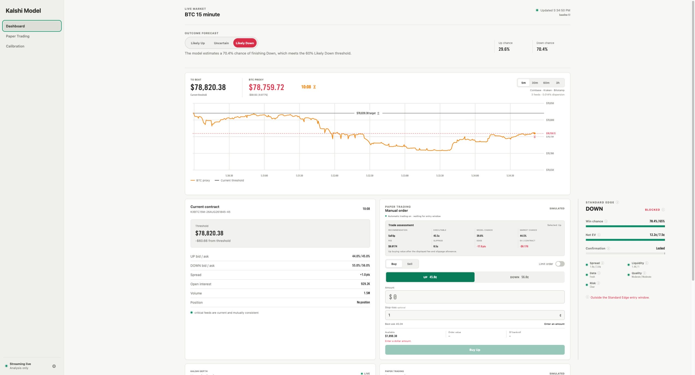
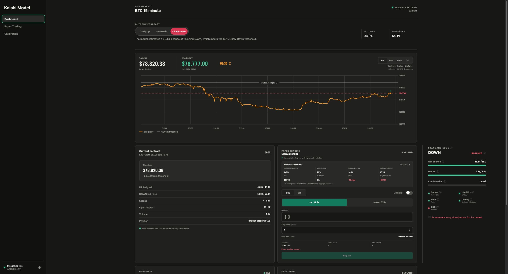
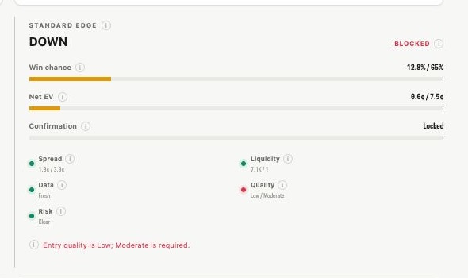
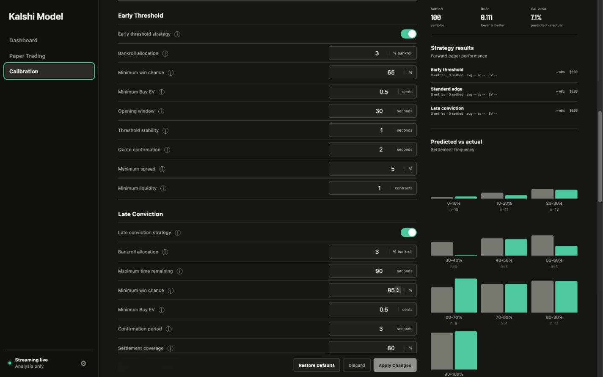

# Kalshi Model

A local macOS research and paper-trading app for Kalshi's 15-minute Bitcoin Up or Down markets; it never places real-money orders.

> Research only, not financial advice.

<table>
  <tr>
    <td width="50%"></td>
    <td width="50%"></td>
  </tr>
  <tr>
    <td align="center"><strong>Light</strong></td>
    <td align="center"><strong>Dark</strong></td>
  </tr>
</table>

## Features

- **Dashboard:** Live BTC proxy, outcome forecast, Standard Edge readiness HUD, order book, recent trades, and manual controls.
- **BTC proxy:** Median Coinbase, Kraken, and Bitstamp price with learned BRTI uncertainty.
- **Paper trading:** Manual and automatic strategies with available funds recorded after each transaction.
- **Calibration:** Tune each strategy and review its results separately.
- **Local data:** Settings, evidence, trades, snapshots, reports, and backups stay in SQLite on your Mac.

## Outcome forecast


- **Likely Up:** Up probability is 60% or higher.
- **Uncertain:** Up probability is above 40% and below 60%.
- **Likely Down:** Up probability is 40% or lower.
- The forecast always describes the expected outcome; price, edge, and trade action stay in **Trade assessment**.

## Standard Edge HUD



- Win chance and net EV fill toward their configured targets; confirmation starts only after every entry requirement passes.
- Spread, liquidity, data, quality, and risk show what is blocking an automatic entry.
- Hover over an info icon for a plain-language explanation of any metric.

## Calibration



- Apply saves one auditable configuration snapshot; Discard and Restore are reversible.
- Results show settled samples, Brier score, and calibration in 10-point probability ranges.
- Automatic entries still require a valid price, positive Buy EV, confirmation, liquidity, and risk approval.

## Kalshi credentials


- Public REST data works without credentials; a Key ID and RSA private key enable live WebSocket prices.
- Add them in **Settings**; the private copy stays under `~/Library/Application Support/Kalshi Model/`.
- Never commit `.env`, your Key ID, or your private key.

<details>
<summary>Developer <code>.env</code> setup</summary>

```bash
cp .env.example .env
```

```bash
KALSHI_API_KEY_ID=your-key-id
KALSHI_PRIVATE_KEY_PATH=/absolute/path/to/your-private-key.pem
```

</details>

## How the model works

The app answers two separate questions: **What is likely to happen?** and **Is the contract worth its price?**

### Outcome forecast

It combines live Bitcoin prices, threshold distance, time, volatility, momentum, and settlement history to estimate the chance of Up.

- **Likely Up:** 60% or higher.
- **Uncertain:** Between 40% and 60%.
- **Likely Down:** 40% or lower.

### Trade assessment

It then compares that probability with the selected Buy or Sell price after fees and slippage; a likely outcome can still be overpriced.

### Paper strategies

- **Standard edge:** Waits for a strong, sustained pricing advantage.
- **Early threshold:** Uses a threshold seen before opening, but enters only if the opening ask still offers positive EV.
- **Late conviction:** Buys a highly likely outcome near settlement only when Buy EV remains positive.

Only one automatic strategy may enter each market, and early threshold takes priority over standard edge and late conviction.

### Risk and learning

Every entry remains simulated and must pass cash, liquidity, exposure, drawdown, and confirmation checks.

Calibration compares predicted probabilities with settled outcomes and reports each strategy separately; judge results across many markets, not a short streak.

## Download

[**Download the latest Apple Silicon Mac app**](https://github.com/jganiyu/kalshi-model/releases/latest/download/Kalshi-Model-macOS-arm64.zip), move it to Applications, then right-click **Open** on first launch.

## Run from source

```bash
git clone https://github.com/jganiyu/kalshi-model.git
cd kalshi-model
./start.sh
```

Requires macOS and Python 3.11 or newer; the app opens at [http://127.0.0.1:8765](http://127.0.0.1:8765).

## Test

```bash
.venv/bin/python -m pytest
```

## Build the Mac app

```bash
./scripts/build_macos_app.sh
```

The signed ZIP is written to `dist/`.
