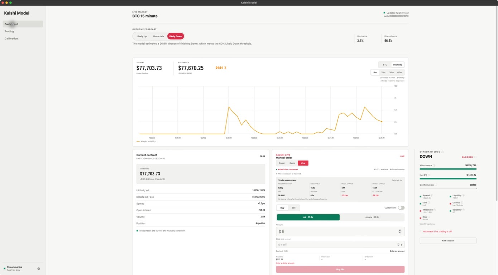
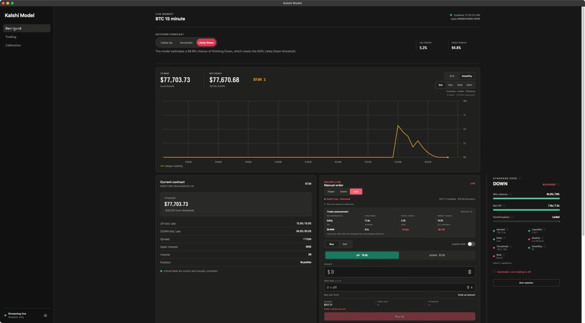
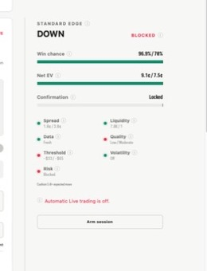
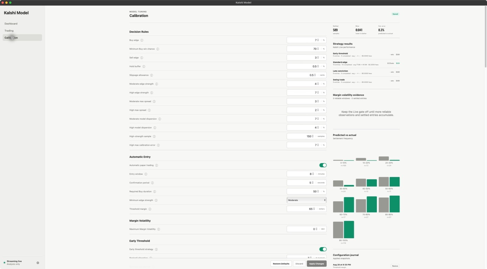
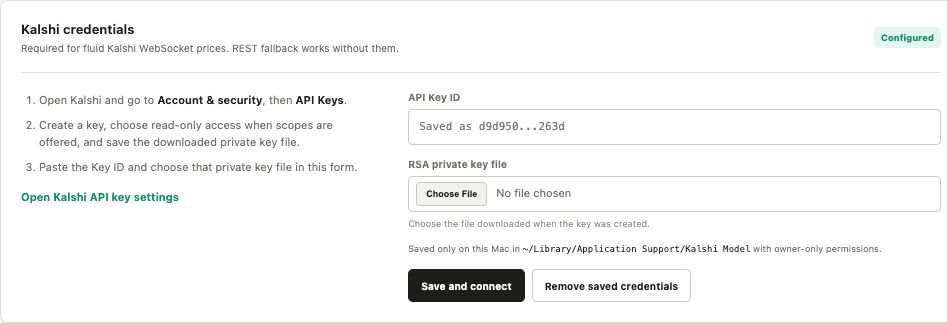
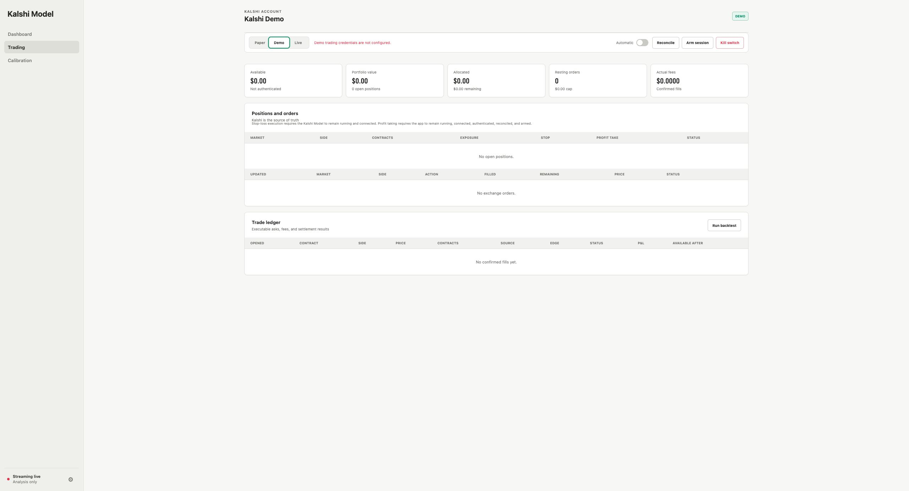
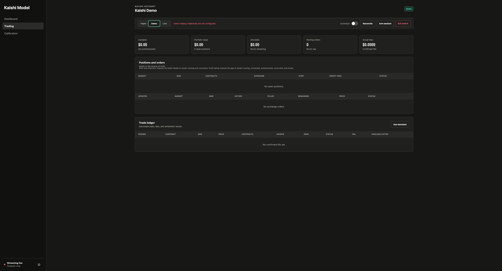
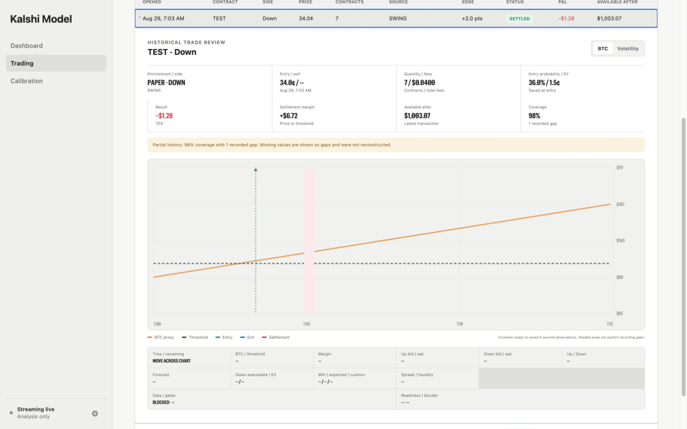
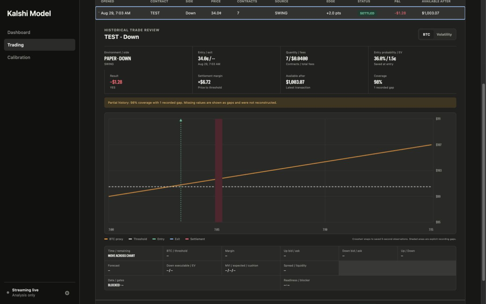

# Kalshi Model

A local macOS research and trading app for Kalshi's 15-minute Bitcoin Up or Down markets. Paper is the default; Demo and Live are optional.

> Research only, not financial advice. Live trading can lose real money.

<table>
  <tr>
    <td width="50%"></td>
    <td width="50%"></td>
  </tr>
  <tr>
    <td align="center"><strong>Light</strong></td>
    <td align="center"><strong>Dark</strong></td>
  </tr>
</table>

## Features

- **Dashboard:** Live BTC proxy, outcome forecast, Standard Edge HUD, margin volatility, positions, and manual controls.
- **BTC proxy:** Median Coinbase, Kraken, and Bitstamp price with learned BRTI uncertainty.
- **Three modes:** Paper, isolated Kalshi Demo, and deliberately armed Kalshi Live.
- **Mobile Monitor:** Read-only HUD, market metrics, and recent trades on iPhone through Tailscale.
- **Strategies:** Standard Edge, Early Threshold, Late Conviction, and Swing.
- **Calibration:** Tune strategies and review probability, volatility, and volume evidence.
- **Trade review:** Expand a settled trade to replay its BTC, probability, MVI, readiness, and execution history.
- **Local data:** Settings, evidence, trades, review snapshots, reports, and backups stay in SQLite on your Mac.

## Outcome forecast


- **Likely Up:** Up probability is 60% or higher.
- **Uncertain:** Up probability is above 40% and below 60%.
- **Likely Down:** Up probability is 40% or lower.
- The forecast always describes the expected outcome; price, edge, and trade action stay in **Trade assessment**.

## Standard Edge HUD



- Win chance and net EV fill toward their configured targets; confirmation starts only after every entry requirement passes.
- Spread, liquidity, data, quality, threshold, volatility, and risk show what is blocking an automatic entry.
- **MVI** scores 30-minute threshold-margin volatility from 0–10; cushion compares today’s margin with the expected remaining move.
- Hover over an info icon for a plain-language explanation of any metric.

## Calibration



- Apply saves one auditable configuration snapshot; Discard and Restore are reversible.
- Results show settled samples, Brier score, and calibration in 10-point probability ranges.
- Margin Volatility has one maximum setting; `0` leaves the gate off while evidence accumulates.
- Automatic entries still require a valid price, positive Buy EV, confirmation, liquidity, and risk approval.

## Kalshi credentials



- Public REST works without credentials; a read key enables faster market-data streaming.
- Demo and Live trading use separate write-enabled keys and separate account histories.
- Add keys in **Settings**; private copies stay under `~/Library/Application Support/Kalshi Model/`.
- Never commit `.env`, your Key ID, or your private key.

<details>
<summary>Developer <code>.env</code> setup</summary>

```bash
cp .env.example .env
```

```bash
KALSHI_API_KEY_ID=your-key-id
KALSHI_PRIVATE_KEY_PATH=/absolute/path/to/your-private-key.pem
KALSHI_DEMO_API_KEY_ID=your-demo-key-id
KALSHI_DEMO_PRIVATE_KEY_PATH=/absolute/path/to/demo-key.pem
KALSHI_LIVE_API_KEY_ID=your-live-key-id
KALSHI_LIVE_PRIVATE_KEY_PATH=/absolute/path/to/live-key.pem
```

</details>

## How the model works

The app answers two separate questions: **What is likely to happen?** and **Is the contract worth its price?**

### Outcome forecast

It combines live Bitcoin prices, threshold distance, time, volatility, momentum, and settlement history to estimate the chance of Up.

- **Likely Up:** 60% or higher.
- **Uncertain:** Between 40% and 60%.
- **Likely Down:** 40% or lower.

### Volume signals — shadow phase

Volume does not add a fixed probability bonus. The model learns whether each input improves settled-contract forecasts:

- **Relative volume:** Compares one- and five-minute activity with normal activity; it measures conviction, not direction by itself.
- **Signed BTC flow and CVD:** Tracks buyer- versus seller-initiated Coinbase and Kraken volume; buying pressure can support Up and selling pressure can support Down.
- **Volume-confirmed momentum:** Gives more weight to directional price moves backed by participation and less to quiet moves.
- **VWAP position:** Measures whether the BTC proxy is above or below its recent volume-weighted average, supporting Up or Down accordingly.
- **Kalshi flow and turnover:** Tracks aggressive Up/Down trades and activity relative to open interest; agreement with BTC flow can reinforce a forecast, while disagreement can weaken it.
- **Context and data quality:** Interprets volume alongside time remaining, threshold distance, volatility, and settlement progress; missing or conflicting feeds remain unavailable instead of becoming false evidence.

These inputs are **shadow-only for now**. They are recorded and tested without changing the live probability until enough settled data shows better out-of-sample Brier score and calibration.

### Trade assessment

It then compares that probability with the selected Buy or Sell price after fees and slippage; a likely outcome can still be overpriced.

### Trading strategies

- **Standard edge:** Waits for a strong, sustained pricing advantage.
- **Early threshold:** Uses a threshold seen before opening, but enters only if the opening ask still offers positive EV.
- **Late conviction:** Buys a highly likely outcome near settlement only when Buy EV remains positive.
- **Swing trade:** Buys a model-supported side at a low early ask, then sells when its executable bid reaches the configured target.

Only one automatic strategy may enter each market. Swing runs last so it cannot displace the existing strategies.

### Risk and learning

Every entry must pass price, liquidity, data, threshold, volatility, confirmation, allocation, and risk checks.

Margin Volatility measures how choppily the BTC proxy is moving around the threshold. Low readings never block; a reading above the configured maximum blocks automatic confirmation in every mode. Cushion is recorded for analysis but is not an entry gate.

A global profit take exits at a configured executable bid—99¢ by default. Stop-losses are optional and off by default.

Calibration compares predicted probabilities with settled outcomes and reports each mode and strategy separately; judge results across many markets, not a short streak.

## Paper, Demo, and Live

<table>
  <tr>
    <td width="50%"></td>
    <td width="50%"></td>
  </tr>
  <tr>
    <td align="center"><strong>Demo · Light</strong></td>
    <td align="center"><strong>Demo · Dark</strong></td>
  </tr>
</table>

- **Paper:** Local simulated fills and bankroll; no Kalshi order is sent.
- **Demo:** Kalshi's test exchange is the source of truth for balance, orders, partial fills, fees, positions, and settlement.
- **Live:** Real funds. Demo verification, reviewed limits, two-click session arming, and a separate Automatic switch are required.

Demo and Live default to a 100% eligible-funds cap, but strategy sizing and hard limits still keep individual orders smaller. Positions, resting buys, pending intents, fees, and reserved exposure all count against the cap.

All exchange orders are price-limited and may fill partially. A kill switch blocks new submissions and attempts to cancel resting orders. After a restart or disconnect, the app reconciles with Kalshi and requires rearming.

Stop-losses and the global profit take are app-managed in Demo and Live. They work only while the app is running, connected, authenticated, reconciled, and armed; execution is not guaranteed.

## Historical trade review

<table>
  <tr>
    <td width="50%"></td>
    <td width="50%"></td>
  </tr>
  <tr>
    <td align="center"><strong>Light</strong></td>
    <td align="center"><strong>Dark</strong></td>
  </tr>
</table>

- Click a settled trade to open its full 15-minute review directly in the ledger.
- Move across the chart for saved price, probability, MVI, volume flow, EV, readiness, and data-quality readings.
- Entry, exit, and settlement markers explain when the position changed; recording gaps stay visible.
- Reviews are recorded only for traded markets; open and legacy trades do not invent history.

## Mobile Monitor

The read-only iPhone view shows To Beat, BTC Proxy, the Kalshi timer, Standard Edge readiness, and the latest 10 trades for the environment selected on the Mac.

1. Install Tailscale on the Mac and iPhone, then enable **Settings → Mobile Monitor**.
2. Click **Copy command**, paste it into Terminal, and press Return. The app uses the full CLI command required by Mac App Store installations.
3. Terminal prints the private `https://…ts.net` address. Click **Refresh private URL**, open it in iPhone Safari, then choose **Share → Add to Home Screen → Open as Web App**.

The monitor has no trading controls and exposes only a dedicated read-only port. The Mac must remain awake, running, and connected. See [Tailscale Serve setup](https://tailscale.com/docs/features/tailscale-serve).

## Download

[**Download the latest Apple Silicon Mac app**](https://github.com/jganiyu/kalshi-model/releases/latest/download/Kalshi-Model-macOS-arm64.zip), move it to Applications, then right-click **Open** on first launch.

## Run from source

```bash
git clone https://github.com/jganiyu/kalshi-model.git
cd kalshi-model
./start.sh
```

Requires macOS and Python 3.11 or newer; the app opens at [http://127.0.0.1:8765](http://127.0.0.1:8765).

## Test

```bash
.venv/bin/python -m pytest
```

The suite never sends Live orders. Demo order creation and cancellation are opt-in:

```bash
KALSHI_DEMO_E2E=1 KALSHI_DEMO_TEST_TICKER=your-demo-market .venv/bin/python -m pytest tests/test_kalshi_demo_e2e.py
```

## Build the Mac app

```bash
./scripts/build_macos_app.sh
```

The signed ZIP is written to `dist/`.
