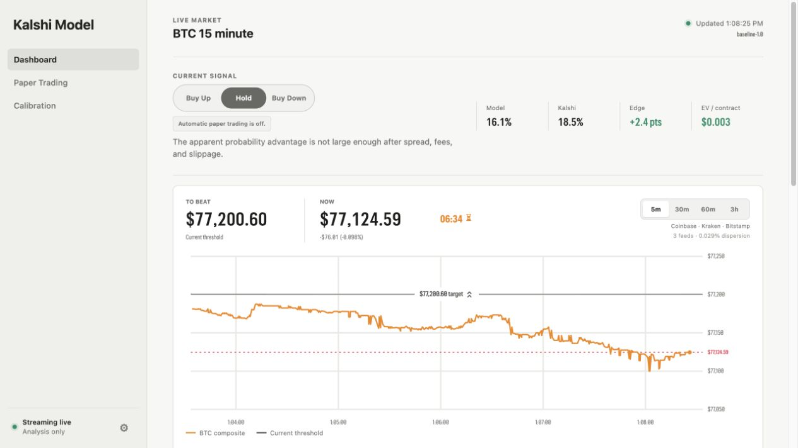
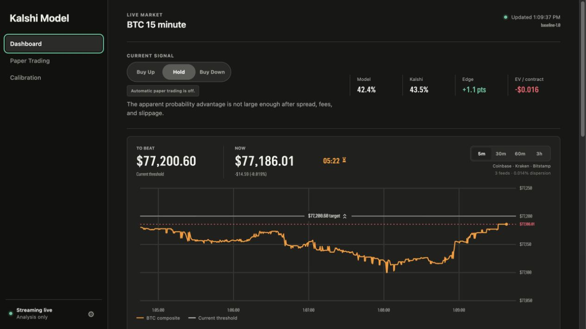
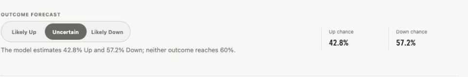

# Kalshi Model

Chief, Kalshi Model is a local Mac command center for Kalshi's 15-minute Bitcoin Up or Down markets. I watch Bitcoin, compare the model's odds with live Kalshi prices, and call Buy Up, Hold, or Buy Down when the math changes. No real orders leave this machine; even I know better than to fire without authorization.

> Research and paper trading only, not financial advice.

<table>
  <tr>
    <td width="50%"></td>
    <td width="50%"></td>
  </tr>
  <tr>
    <td align="center"><strong>Light mode</strong></td>
    <td align="center"><strong>Dark mode</strong></td>
  </tr>
</table>

## What it does

- **Dashboard:** Shows the live model, BTC chart, current contract, paper controls, and Kalshi order books.
- **BTC composite:** Uses the median price from Coinbase, Kraken, and Bitstamp to reduce single-feed noise.
- **Chart:** Tracks BTC, the Kalshi threshold, price delta, market timer, and moving time and price axes.
- **Current contract:** Shows the threshold, bids, asks, spread, liquidity, timer, and paper position.
- **Paper Trading:** Simulates market and limit orders without sending anything to Kalshi.
- **Order books:** Displays live Up and Down bids, asks, contract depth, and total value.
- **Calibration:** Measures forecast accuracy and decides when a trained model is ready to replace the baseline.
- **Local storage:** Keeps settings, model evidence, paper trades, and backups in SQLite on your Mac.
- **Themes:** Supports system, light, and dark appearance modes.

## Current signal



- **Buy Up:** The Up contract has positive expected value and clears the configured executable-edge requirement.
- **Hold:** Neither contract safely clears the decision rules, or the required market data is not reliable.
- **Buy Down:** The Down contract has positive expected value and clears the configured executable-edge requirement.
- **Confidence:** Rates the signal using edge, spread, model agreement, sample size, and calibration quality.
- **Explanation:** States the immediate reason for the current signal in plain language.
- **Model:** The model's estimated probability that Bitcoin settles above the threshold.
- **Kalshi:** The Up probability implied by the midpoint of Kalshi's current Up bid and ask.
- **Edge:** The model's probability advantage over Kalshi's midpoint for the preferred contract.
- **EV / contract:** Estimated profit for one preferred-side contract after price, slippage, and Kalshi's taker fee.
- **Paper status:** Shows whether automatic paper trading may act on a qualifying signal.

## Model logic

- **Distance:** Measures how far BTC is above or below the current Kalshi threshold.
- **Time:** Increases the threshold's importance as the 15-minute market approaches settlement.
- **Movement:** Uses volatility, momentum, recent range, volume acceleration, and exchange dispersion.
- **Market context:** Adds order-book imbalance and Kalshi's implied probability when enough training data exists.
- **Probability:** Starts with a volatility-adjusted baseline and can graduate to regularized logistic regression.
- **Decision:** Compares Up and Down after executable asks, slippage, fees, and the minimum edge setting.
- **Sizing:** Uses capped fractional Kelly sizing with bankroll, position, liquidity, and drawdown limits.
- **Safety:** Holds during stale feeds, high dispersion, contract transitions, or missing executable prices.

## Calibration

- **Settlement matching:** Pairs each settled contract with its last stored prediction.
- **Brier score:** Measures squared probability error; lower is better.
- **Calibration error:** Measures the gap between predicted probabilities and observed outcomes; lower is better.
- **Candidate training:** Begins after 12 settlements and uses up to the latest 1,000 contracts.
- **Validation:** Uses expanding-window forward tests so future results never leak into earlier training.
- **Promotion:** Requires 120 settlements, 7 UTC days, a `0.005` Brier improvement, and no major calibration loss.
- **Schedule:** Rechecks after each of the first 20 settlements, then once per UTC day when new evidence arrives.
- **Independence:** Resetting paper trading never erases model evidence or calibration history.

## Kalshi credentials


- **Without credentials:** Public REST data works, but Kalshi prices update less fluidly.
- **With credentials:** Your API Key ID and RSA private key enable the live Kalshi WebSocket.
- **Create a key:** Open Kalshi's **Account & security**, choose **API Keys**, and use read-only access when available.
- **Connect:** Open Kalshi Model's **Settings**, enter the Key ID, choose the downloaded key file, and press **Save and connect**.
- **Storage:** The app saves a protected local copy under `~/Library/Application Support/Kalshi Model/`.
- **Security:** Never commit `.env`, your Key ID, or your private key.

<details>
<summary>Developer alternative: configure credentials with <code>.env</code></summary>

Create the local environment file:

```bash
cp .env.example .env
```

```bash
KALSHI_API_KEY_ID=your-key-id
KALSHI_PRIVATE_KEY_PATH=/absolute/path/to/your-private-key.pem
```

</details>

## Local data

- **Database:** Each installation creates its own `data/kalshi_model.db` and starts with a fresh paper account.
- **Settlement source:** Kalshi settles with CF Benchmarks BRTI while the app uses a multi-exchange spot composite as a live proxy.
- **Privacy:** Credentials, databases, backups, and generated app bundles are ignored by Git.

## Tests

```bash
.venv/bin/python -m pytest
```

Tests cover model math, fees, signal gates, risk controls, paper orders, settlement, calibration, promotion, and streaming order books.

## Get the app

Choose one route; most people should use the download.

### 1. Download the Mac app (recommended)

[**Download the latest Apple Silicon Mac ZIP**](https://github.com/jganiyu/kalshi-model/releases/latest/download/Kalshi-Model-macOS-arm64.zip)

1. Download and open the ZIP.
2. Move `Kalshi Model.app` to your Applications folder.
3. On first launch, right-click the app and choose **Open**.
4. Add your Kalshi credentials in the app's **Settings** page.

This route needs no Python or Terminal; private-repository collaborators must be signed in to GitHub.

### 2. Run from source

Use this route for development or code changes.

```bash
git clone https://github.com/jganiyu/kalshi-model.git
cd kalshi-model
./start.sh
```

This requires macOS, Python 3.11 or newer, and opens the app at [http://127.0.0.1:8765](http://127.0.0.1:8765).

### 3. Build the Mac app yourself

Use this route to create a fresh `.app` and ZIP from the source code.

```bash
git clone https://github.com/jganiyu/kalshi-model.git
cd kalshi-model
./scripts/build_macos_app.sh
```

You do not run `./start.sh` first; the build script creates its own environment and writes both files to `dist/`.

`git clone` downloads the project from GitHub; the build script then works entirely on your Mac.
